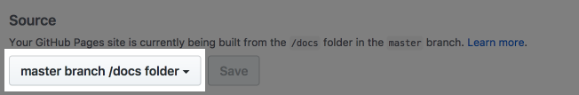

# Thinkcspy Assignments

This repository will be used to create and submit your homework solutions. There are a few steps you'll need to take to get this set up on your computer so you can work on it locally. We'll describe those in the next section. Then, we'll describe how to use the repository, i.e., what is in the folder for each chapter, what files you will need to change, and how your homework will be graded.

## Set Up Instructions

You should have already accepted the assignment via the GitHub Classroom link at learn.launchcode.org, and you should have Python installed locally. The steps you'll take to complete your set up are:

1. Open git bash or a terminal window.
2. Clone this repository on your computer by using the command ``git clone`` and then the url for your account's repository.
3. Install the package ``pytest`` using the command ``conda install pytest``.
4. Then install the package ``pytest-html`` using the command ``pip install pytest-html``.

## How to Test and Submit Your Homework

The process for doing your homework for each chapter is:

1. Look at the "Weekly Graded Assignment Instructions" in the `README.md` for that chapter. There will occasionally be differences between the book's assignment instructions and the instructions in your repository. When there is a difference, **always** follow the repository instructions over the book's.

2. Open up the chapter's folder in your text editor and view the ``solution.py`` file. This file contains the code stub that you will start working with. You will put the rest of the code needed to solve the assignment in this file. When you feel ready to test your code, take the next step.

3. Open git bash or a terminal window and ``cd`` into your repository directory, and then into this chapter's folder.

4. Run the command ``pytest``. You will see a printout of results from the tests executed for this chapter's assignment. If any of the tests failed, you know that you need to go back and fix or expand your code so that all the tests pass. *You should run this command within the folder for the problem you are working on.*

5. It may be helpful to look at the ``test_solution.py`` file to see what kind of tests your code needs to pass.

6. When your code passes all the tests for the given chapter, then you are ready to "grade" your assignment. Here is the process:

    * ``cd`` into the repository's base directory (where all the chapter folders live)
    * Run the command:

        ```nohighlight
        $ ./generate-report.sh
        ```

        Note that the tests from **ALL** chapters will be run, so don't panic if you see that a lot of tests failed. This is because you have not solved them yet!
    * Open ``report.html``  in a browser and make sure that all the tests for the chapter you are working on, and those of previous chapters, have passed.

In order for course staff to be able to view your updated report, you need to do a couple more things.

7. Add and commit your changes, then push your repository to GitHub. (Refer to the [Git Basics Cheatsheet](https://github.com/LaunchCodeEducation/cheatsheets/blob/master/git-basics/README.md) if you need to.)

8. *This step only needs to be done once!*

    * Go to your ``unit-1-assignments-<your-username>`` repository on GitHub.
    * Select *Settings* to view the repository settings.


        
    * Scroll down to the *GitHub Pages* section. Under *Source*, select *master branch /docs folder*.

        

        Save the changes.
    * In your browser, visit `https://<your-github-username>.github.io/unit-1-assignments-<your-username>/report.html`. You should see the output of your grading report.
    * Copy the report URL from the previous step, and add it to the top of this file (`README.md`), using the Markdown syntax:
        ```markdown
        [Grade Report](https://codecamp-stl-may2017.github.io/`unit-1-assignments-<your-username>`/report.html)
        ```

        Your URL will look something like this:
        ```nohighlight
        https://codecamp-stl-may2017.github.io/unit-1-assignments-chrisbay/
        ```
    * After you've done this once, you can skip this step and go to the next for future assignments.

9. Bask in the glow of a job well done!

## Python Style Tips

There are some important standards for how to write code in Python that are outlined in the official [Style Guide for Python Code](https://www.python.org/dev/peps/pep-0008/). Not everything in here will make sense at this early stage of your coding journey, so just be aware of this resource, and consult it if you have questions about how your code should look, what kind of naming to use, etc.

There is one **very important** standard to note. You must be consistent with your choice of using either tabs or spaces to indent your code blocks. The recommended standard, and the one used in all the stub code in your ``solution.py`` files, is to use 4 spaces as your indenting method. If you do not follow this standard and instead mix tabs and spaces, Python will complain and your tests won't run.
